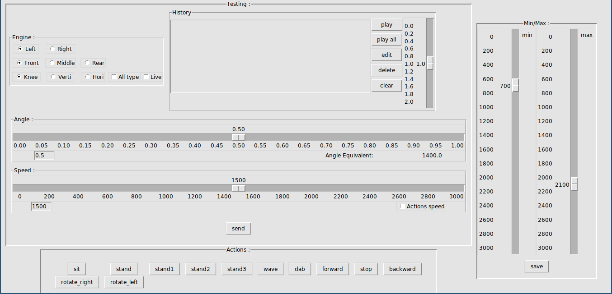

# Hexapod


## Quick start

The Hexapod can be controlled using a tkinter GUI or with a more classic prompt.\
Both work the same way and are easy to use.

1. Plug in the battery

2. Turn it on

3. connect to the Hexapod wifi (no password required)

4. launch Client/gui.py or Client/main.py

5. once you're on the gui juste use the action buttons (sit, stand, walk...)

## About the gui


There are two mains usages for the gui
- Call predefined function (at the bottom). Those are hardcoded movements like sit, stand etc ...

- Test a specific action (most of the others widgets)

#### About predefined function

If you use ```forward```, ```backward```, ```rotate_right``` or ```rotate_left``` you have to stop the movement using ```stop``` 

You must be in position ```stand2``` if you want to call ```


## Pinout

Connect :

-  `VS2+` from the Hexapod to `VIN` on the ESP-32.
-  `VS2-` from the Hexapod to `GND` on the ESP-32.

-  `TX` from the Hexapod to `D2` on the ESP-32.
- `RX` from the Hexapod to `D15` on the ESP-32.
-  `G` from the Hexapod to `GND` on the ESP-32.


#### Flash and power the ESP-32

- Flash the arduino code from `./Arduino_Code` to the ESP-32.

  (we need to fix it, for now flash OLDARDUINOCODE.ino)


# Notes

For any assistance, feel free to ask to:

- `lorenzo.rosmarino@epitech.eu`

- `yohann.assouline@epitech.eu`


- ## /!\ Don't forget to charge the batteries

# Links

The official webpage : http://www.lynxmotion.com/c-117-phoenix.aspx
